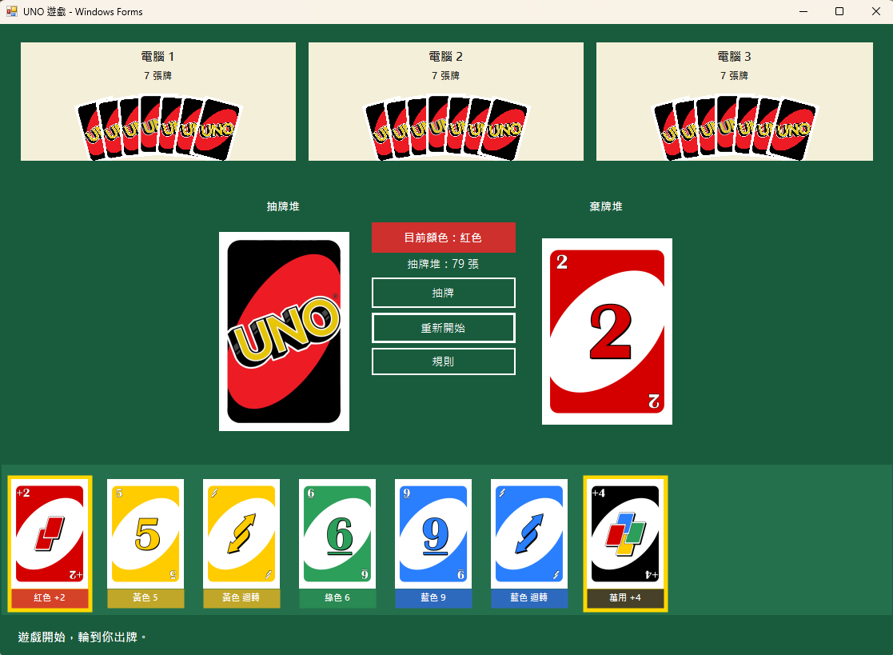

# UNOGame - Windows Forms UNO 遊戲

本遊戲以 UNO 規則為基礎，玩家可以和三位電腦玩家一起遊玩，支援 UNO 牌面圖片、牌背顯示、音效、語音、電腦出牌動畫與繁體中文介面。

## 遊戲畫面

畫面上方為三位電腦玩家，每位電腦玩家會以牌背扇形顯示目前手牌數量；畫面中央是抽牌堆、棄牌堆、目前顏色與操作按鈕；畫面下方是玩家手牌區，玩家可用滑鼠左右拖曳瀏覽手牌。

## 專案資訊

- 專案名稱：UNOGame
- 專案類型：Windows Forms App (.NET Framework)
- 目標框架：.NET Framework 4.7.2
- 開發工具：Visual Studio
- Solution：`UNOGame.sln`
- 專案檔：`UNOGame\UNOGame.csproj`
- 主要程式：
  - `Program.cs`：程式進入點。
  - `MainForm.cs`：遊戲畫面、玩家操作、動畫、音效呼叫與自訂繪圖控制項。
  - `GameEngine.cs`：UNO 遊戲規則、牌堆、棄牌堆、回合與勝負判斷。
  - `Card.cs`：卡牌資料結構與顏色/牌型定義。
  - `AudioPlayer.cs`：透過 Windows MCI 播放 mp3 音效。

## 執行方式

1. 使用 Visual Studio 開啟 `UNOGame.sln`。
2. 確認專案目標框架為 `.NET Framework 4.7.2`。
3. 按 `F5` 執行偵錯，或按 `Ctrl + F5` 直接執行。
4. 若曾經執行過遊戲，重新建置前請先關閉舊的 `UNOGame.exe` 視窗，避免輸出檔被鎖定。

## 遊玩方式

1. 遊戲開始時，玩家與三位電腦玩家各發 7 張牌。
2. 畫面中央右側的棄牌堆會顯示目前最上方的牌，中央標籤會顯示目前顏色。
3. 輪到玩家時，下方手牌中「金色邊框」的牌代表目前可以打出。
4. 點擊可出的牌即可出牌；若打出萬用牌，會跳出視窗讓玩家選擇下一個顏色。
5. 若沒有可出的牌，可以按「抽牌」或點擊抽牌堆抽一張牌，之後回合交給下一位。
6. 玩家手牌太多時，可在下方手牌區按住滑鼠左右拖曳瀏覽，不會出現遮擋卡牌的上下捲軸。
7. 第一位將手牌全部出完的玩家獲勝。

## 出牌規則

一張牌可以被打出，必須符合以下其中一個條件：

- 顏色與目前顏色相同。
- 數字牌的數字與棄牌堆最上方數字相同。
- 功能牌的功能類型與棄牌堆最上方功能相同。
- 該牌是 Wild 或 Wild Draw 4 萬用牌。

範例：如果棄牌堆最上方是「紅色 9」，則可以打出任何紅色牌、任何顏色的 9、或萬用牌；不能打出不同顏色且不同數字的普通數字牌。

## 功能牌規則

- `Skip`：跳過下一位玩家。
- `Reverse`：反轉出牌方向。
- `Draw 2`：下一位玩家抽 2 張牌並跳過回合。
- `Wild`：出牌者指定下一個顏色。
- `Wild Draw 4`：出牌者指定下一個顏色，下一位玩家抽 4 張牌並跳過回合。

## 電腦玩家邏輯

電腦玩家由 `GameEngine.GetBestPlayableCard()` 決定出牌：

1. 先從手牌中找出所有合法可出的牌。
2. 優先打出非萬用牌，避免太早消耗 Wild 牌。
3. 若只有 Wild 或 Wild Draw 4 可出，會根據目前手牌最多的顏色自動選色。
4. 若沒有任何牌可出，電腦會抽一張牌並結束回合。

為了讓遊戲流程更清楚，電腦回合不會瞬間完成，而是先顯示「思考中」，再播放出牌或抽牌動畫。電腦出牌動畫會從電腦手牌移動到棄牌堆；電腦抽牌動畫會從抽牌堆移動到電腦手牌。

## 遊戲流程邏輯

遊戲主要流程由 `GameEngine` 控制：

1. `StartNewGame()` 建立牌堆、洗牌、發牌，並翻出第一張數字牌作為起始牌。
2. `CanPlay(Card card)` 判斷某張牌是否符合目前規則。
3. `PlayCard()` 移除玩家手牌、加入棄牌堆、更新目前顏色並處理功能牌效果。
4. `DrawOne()` 從抽牌堆抽牌；若抽牌堆用完，會保留棄牌堆最上方牌，將其餘棄牌重新洗回抽牌堆。
5. `AdvanceAfterCard()` 根據 Skip、Reverse、Draw 2、Wild Draw 4 決定下一位玩家與懲罰抽牌。
6. 玩家或電腦手牌數量歸零時，設定遊戲結束並顯示勝利訊息。

## 介面與互動功能

- 全繁體中文介面。
- 真正 UNO 牌面圖片。
- 指定 UNO 牌背圖片。
- 電腦手牌以牌背扇形展開顯示。
- 玩家手牌可水平拖曳瀏覽。
- 可出牌以金色邊框提示。
- 目前顏色以中央色塊與文字顯示。
- 電腦玩家有思考狀態與抽牌/出牌動畫。
- 勝利時顯示訊息並播放對應語音。

## 音效與語音

音效檔位於 `UNOGame\Resources\Audio`：

- `drawing-card_soundEffect.mp3`：抽牌音效。
- `put card_soundEffect.mp3`：出牌音效。
- `遊戲開始.mp3`：遊戲開始語音。
- `UNO.mp3`：剩一張牌時播放。
- `你贏了.mp3`：玩家獲勝語音。
- `電腦1獲勝.mp3`、`電腦2獲勝.mp3`、`電腦3獲勝.mp3`：電腦獲勝語音。
- `紅色.mp3`、`黃色.mp3`、`綠色.mp3`、`藍色.mp3`：萬用牌選色語音。